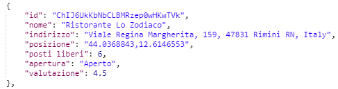
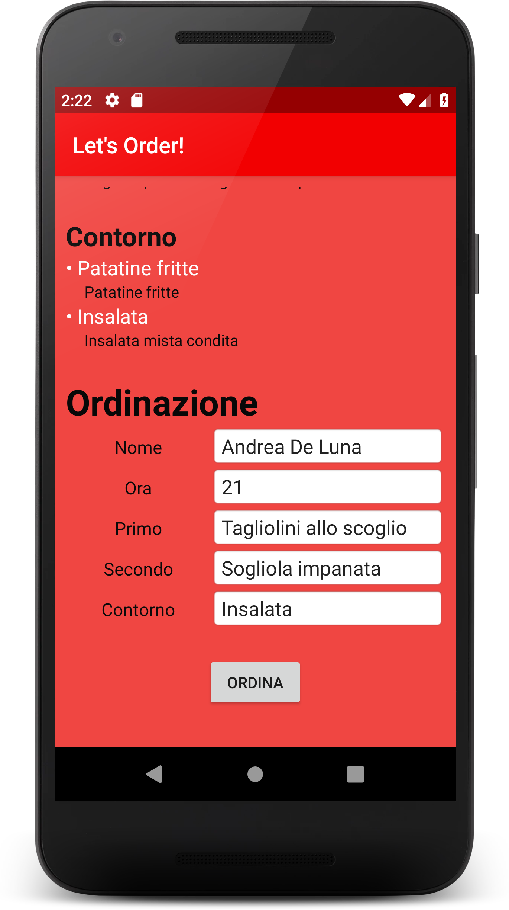

# 👨🏻‍🍳 Let's Order! 🍺 #

## Progetto Piattaforme Digitali per la Gestione del Territorio ##

### Appello: ###
* Secondo appello sessione estiva 2018/2019

### Studente: ###
* [Andrea De Luna](https://github.com/andreadeluna)

-----------------------------------------------------

### Descrizione ###
Gli obiettivi principali del progetto "Let's Order!" sono:

    * Ricerca dei ristoranti nelle vicinanze
    * Visualizzazione dei dati dei ristoranti
    * Visualizzazione delle recensioni dei clienti per i ristoranti
    * Visualizzazione del menù del ristorante
    * Prenotazione al ristorante e ordinazione delle portate dal menù

-----------------------------------------------------

### Relazione ###
Il progetto è composto da 3 sezioni principali, ossia la realizzazione di un'API in NodeJS, al fine di realizzare un'operazione di GET sul database dei ristoranti dell'API Places di Google, l'implementazione di un bot Telegram in Python, al fine di ricercare i ristoranti nelle vicinanze, visualizzarne i dati e le relative recensioni rilasciate dai clienti, e l'implementazione di un'applicazione Android in XML e Java, al fine di cercare i ristoranti, prenotare e ordinare i Piatti direttamente dal proprio smartphone mediante un metodo di POST, direttamente collegato al Realtime DataBase di "Let's Order!".
Si è scelto appositamente di sviluppare sia l'App che il Bot in quanto complementari, dato che le operazioni svolte su entrambe sono ad ogni modo appunto complementari. Infatti, il Bot permetterà di visualizzare esclusivamente le informazioni e le recensioni dei ristoranti, mentre l'App permetterà esclusivamente di prenotare e ordinare.

-----------------------------------------------------

### Let's Order API ###

L'API permette di interfacciarsi relativamente all'API Places di Google e, mediante metodo GET, permette di reperire informazioni relative ai ristoranti presenti in un determinato paese (inserito dall'utente).
L'API permetterà anche di esporre un metodo POST, in modo da determinare (in modo casuale) il numero di posti liberi al momento all'interno del ristorante. Tale scelta è data dal fatto che l'API, oltre che fungere a livello informativo, può a sua volta fungere a livello utilitario, in quanto, come già accennato, permette anche la prenotazione di un posto per il pranzo o la cena.

L'API permetterà inizialmente, a seguito dell'inserimento della posizione da parte dell'utente, di acquisire i dati dei ristoranti dall'API Places di Google effettuando una richiesta HTTP per accedere ai dati, effettuare il parsing dei dati ricevuti, manipolare i dati ed inserirli in una apposita struttura sottoforma di JSON e relativamente restituirla per permetterne la visualizzazione.
A seguito di un controllo sugli orari del ristorante, l'API definirà automaticamente se il ristorante risulta essere aperto o chiuso e, nel caso in cui sia chiuso, porrà i posti disponibili a 0, nel caso invece in cui il ristorante sia aperto, porrà i posti disponibili ad un numero casuale compreso tra 0 e 50.

------------------------------------

### Let's Order Bot ###

 
 
Let's Order Bot è un semplice bot che permette di cercare, mediante l'inserimento di una determinata posizione da parte dell'utente, una lista di ristoranti presenti nelle vicinanze. A seguito della ricerca e della presentazione dei ristoranti, l'utente sceglierà il ristorante da lui desiderato per visualizzarne le informazioni. Nel caso in cui all'interno della lista non sia presente un ristorante di suo gradimento,l'utente potrà cercare il ristorante inserendone direttamente il nome. 
A seguito della visualizzazione delle informazioni, composte da nome, posizione, valutazione e orari, l'utente avrà la possibilità di visualizzare una lista di Recensioni (recuperate da Google) rilasciate da clienti che sono già stati nel suddetto ristorante.
Il bot è stato realizzato utilizzando la libreria <a href="https://github.com/nickoala/telepot">Telepot</a>, e si interfaccia all'API di Let'Order, precedentemente caricata su Heroku.

----------------------------------------------------------

### Let's Order App ###

 
 
 
L'App "Let's Order!" è una semplice App Android che permette di cercare un determinato ristorante ed effettuare una prenotazione, con conseguente ordinazione dal menù. L'App, direttamente collegata con Firebase, permette all'utente di registrarsi ed effettuare il login e, a seguito di una ricerca, selezionare un ristorante da lui desiderato ed interagire con esso effettuando una prenotazione, mediante un metodo di POST direttamente sul Realtime DataBase in Firebase dell'Applicazione. Tale operazione è effettuata simultaneamente anche nell'API di Let's Order.
L'ordinazione, acquisita mediante input da parte dell'utente, viene acquisita e inserita all'interno del DataBase sottoforma di una struttura JSON, organizzata appositamente per utente e contenente i dati della prenotazione e relativamente dell'ordinazione, ossia:

    * Nome
    * Ora
    * Primo
    * Secondo
    * Contorno

A seguito dell'operazione di ordinazione, verrà visualizzato un riepilogo, per verificare che i dati siano stati acquisiti correttamente.

----------------------------------------------------------
### Links e riferimenti ###
* Link API lista ristoranti Urbino (esempio):
    * https://letsorderapi.herokuapp.com/?tipo=luogo&lista=rimini
    * https://letsorderapi.glitch.me/?tipo=diretto&lista=lapiazzettamisano
* Link alla documentazione dell'API: https://app.swaggerhub.com/apis/andreadeluna/LetsOrder/1.0.0

